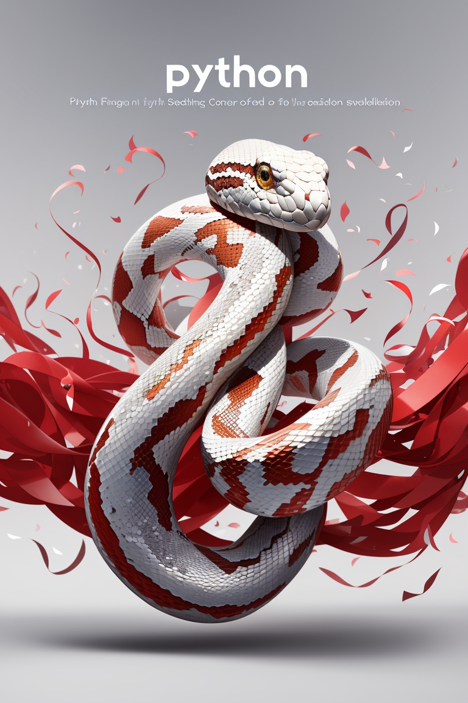

<div align="center">

# 👋 Javier Fiestas Botella

### 🐍 Python Developer · 🌐 Web Developer · 🤖 AI & Data

### ⚡ Creator of **FI-BOT IA · Experiences**

<br>



<br><br>

**Transformando ideas y necesidades reales en soluciones digitales.**

Python · Inteligencia Artificial · Desarrollo Web · Automatización · Datos

</div>

---

## 👨‍💻 Sobre mí

¡Hola! Soy **Javier Fiestas Botella**, desarrollador apasionado por **Python, la Inteligencia Artificial y el desarrollo web**.

Mi camino en la programación comenzó durante la pandemia. Lo que empezó como una forma de aprovechar el tiempo y aprender algo nuevo terminó convirtiéndose en una auténtica pasión por crear, experimentar y resolver problemas mediante código.

Desde entonces he continuado formándome y, sobre todo, llevando lo aprendido a **proyectos reales**.

Me gusta detectar una necesidad, entender cómo funciona y preguntarme:

> **¿Se podría hacer esto mejor con tecnología?**

Muchas veces, de esa pregunta nace un nuevo proyecto.

<br>

<div align="center">


</div>

---

# ⚡ FI-BOT IA · Experiences

**FI-BOT IA** es mi firma para el desarrollo de proyectos, herramientas y experiencias digitales.

```text
FI-BOT IA · Experiences
Code · AI · Web · Automation
```

La filosofía es sencilla:

> **Tecnología útil. Experiencias sencillas. Soluciones reales.**

Bajo **FI-BOT IA · Experiences** desarrollo proyectos relacionados con:

🐍 Python
🤖 Inteligencia Artificial
🌐 Desarrollo Web
⚙️ Automatización
📊 Datos
🍽️ Tecnología aplicada a restauración
🧩 Herramientas y aplicaciones digitales

---

# 🛠️ Tech Stack

### 💻 Desarrollo


### 🤖 IA & Data


### ⚙️ Herramientas


---

# 🚀 Proyectos destacados

## 🍷 Carta Interactiva · La Chancla

Diseño y desarrollo de una **experiencia digital interactiva para restauración**, creada para ofrecer una forma más visual, sencilla y dinámica de consultar productos y categorías.

El proyecto combina navegación interactiva, diseño responsive y una arquitectura preparada para evolucionar y reutilizarse.

**Tecnologías**

`HTML5` · `CSS3` · `JavaScript`

**Diseño & Desarrollo**

⚡ **FI-BOT IA · Experiences**

---

## 🍹 Herramientas digitales · La Chancla

Desarrollo de diferentes herramientas orientadas a resolver necesidades reales dentro del funcionamiento diario de un establecimiento de restauración.

Entre ellas:

* 🍷 Carta digital de vinos
* 🍸 Carta interactiva de cócteles
* 📊 Herramientas de escandallos
* 💰 Control y análisis de costes
* 🧾 Gestión y presentación de productos
* ⚙️ Automatización de procesos
* 📱 Aplicaciones web internas
* 🔗 Experimentación e integración con APIs
* 📈 Análisis mediante Python y Excel

Una parte importante de mi forma de aprender programación consiste precisamente en esto:

> **crear herramientas que solucionen problemas que existen en el mundo real.**

---

## 🧘 Silvia García Cuesta

Diseño y desarrollo de la página web de **Silvia García Cuesta**, profesional especializada en:

* Pilates
* Qigong
* Quiromasaje
* Movimiento y bienestar

🌐 **Web:**
[www.silviagarciacuesta.com](https://www.silviagarciacuesta.com/)

Proyecto desarrollado buscando especialmente una experiencia **limpia, sencilla y accesible para cualquier usuario**.

**Diseño & Desarrollo**

⚡ **FI-BOT IA · Experiences**

---

## 🥗 Vegetariano El Calafate

Uno de mis primeros proyectos web reales.

Diseño y desarrollo de la página web del restaurante **Vegetariano El Calafate**, donde pude comenzar a aplicar mis conocimientos de programación fuera del entorno puramente académico.

Este proyecto fue uno de los primeros pasos que me permitió pasar de:

```text
APRENDER CÓDIGO
      ↓
CREAR CON CÓDIGO
      ↓
RESOLVER PROBLEMAS REALES
```

---

# 🤖 Inteligencia Artificial

La **Inteligencia Artificial** se ha convertido en una parte fundamental de mi evolución como desarrollador.

Trabajo, estudio y experimento con IA aplicada a:

* 🧠 Desarrollo asistido de software
* ⚙️ Automatización
* 📊 Análisis y tratamiento de datos
* 🌐 Desarrollo de aplicaciones
* 🎨 Generación de contenido
* 🔗 Integración de IA en proyectos
* 💡 Creación de nuevas experiencias digitales

No me interesa utilizar IA simplemente porque sea una tecnología nueva.

Me interesa especialmente descubrir:

> **¿Qué podemos hacer ahora que antes era difícil, lento o directamente imposible?**

---

# 🎓 Formación

### 🐍 Python · Tokio School

Formación especializada en **Python**, realizando proyectos prácticos y consolidando conocimientos de programación y desarrollo.

### 🤖 Inteligencia Artificial & Data

Formación y aprendizaje continuo relacionado con:

* Artificial Intelligence
* Machine Learning
* Amazon SageMaker (AWS)
* Great Expectations
* Análisis de datos
* Python
* Automatización

También he ampliado mi formación mediante plataformas y escuelas como:

**Tokio School · Udemy · Píldoras Informáticas · KeepCoding**

---

# 📚 Aprendizaje continuo

Una de las cosas que más me gustan de la programación es precisamente que **nunca se termina de aprender**.

Continúo estudiando, probando tecnologías y desarrollando proyectos de manera autónoma.

Cada nuevo proyecto es una oportunidad para aprender algo que no sabía hacer anteriormente.

```python
while True:
    learn()
    build()
    improve()
```

🕸️ Y sí... sigo pensando que programar se parece un poco a construir una telaraña:

**muchas pequeñas conexiones que, cuando están bien construidas, terminan creando algo mucho más grande.**

---

# 🌐 Encuéntrame

### 👨‍💻 GitHub

[](https://github.com/Javierfiestasbotella)

### 🌍 Portfolio

[](https://javierfiestasbotella.github.io/)

---

<div align="center">


<br>

## Javier Fiestas Botella

**Python · Web Development · Artificial Intelligence · Data**

### ⚡ FI-BOT IA · Experiences

*Diseño y desarrollo de experiencias digitales*

<br>

`CODE` · `AI` · `WEB` · `AUTOMATION`

<br>

**© 2026 Javier Fiestas Botella · FI-BOT IA**

</div>


- 🔭 I’m currently working on ...
- 🌱 I’m currently learning ...
- 👯 I’m looking to collaborate on ...
- 🤔 I’m looking for help with ...
- 💬 Ask me about ...
- 📫 How to reach me: ...
- 😄 Pronouns: ...
- ⚡ Fun fact: ...
-->
